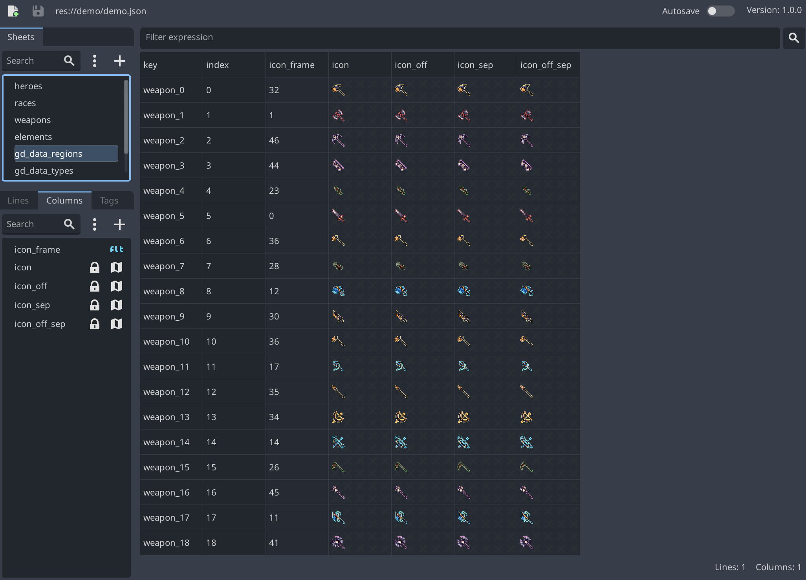

# GDData

Create sheets to manage all your data in your Godot games using expressions !



## Handled type:
- **Text**: Any string
- **Number**: Any number
- **Bool**: true / false
- **Color**: HTML hexadecimal color string in RGBA format (ex: "ff34f822")
- **File**: Any file
- **Image**: .bmp, .dds, .exr, .hdr, .jpg, .jpeg, .png, .tga, .svg, .svgz, .webp
- **Audio**: .wav, .ogg, .mp3
- **3D**: .gltf, .glb, .dae, .escn, .fbx, .obj
- **Scene**: .tscn
- **Script**: .gd
- **Resource**: .tres
- **Reference**: To another line from another sheet
- **Object**: Any array or dictionary
- **Region**: An image that crops out part of another image

## Expression:
Use [Godot expression](https://docs.godotengine.org/en/stable/tutorials/scripting/evaluating_expressions.html) system to compute your data:
- A simple mathematical expression such as ```(2 + 4) * 16/4.0```.
- A built-in method call like ```deg_2_rad(90)```.
- A conditional statements result like ```test(1 < 2, "Obvious", "Oh wait ...")```
- A function using any other column value such as ```values.col1 + (values.col2 * 2)```

## Installation

To install a plugin, download it as a ZIP archive.

Extract the ZIP archive and move the addons/ folder it contains into your project folder. If your project already contains an addons/ folder, move the plugin's addons/ folder into your project folder to merge the new folder contents with the existing one. Your file manager may ask you whether to write into the folder; answer Yes. No files will be overwritten in the process.

---

[MIT License](https://github.com/wod-rsarrazin/gd-data/blob/main/LICENSE)
